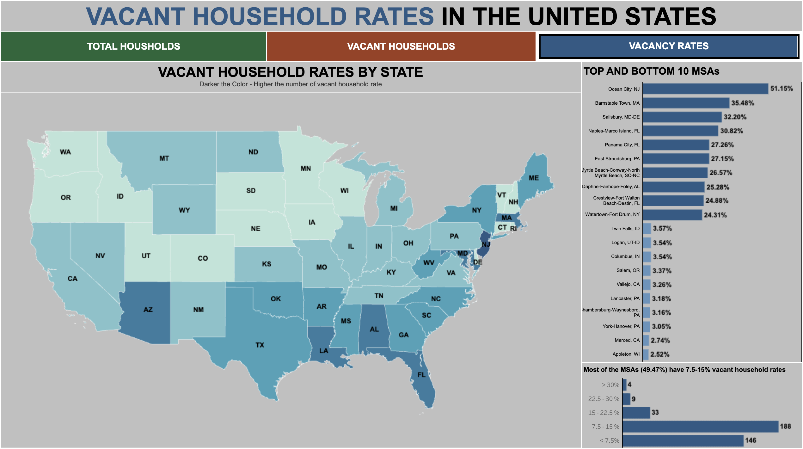

# Vacant Household Rates in US Metropolitan Statistical Areas (MSAs)

## Overview
This repository contains the Tableau dashboard created for the Make Over Monday 2024 Week 11 challenge. The dashboard visualizes vacant household rates in various US Metropolitan Statistical Areas (MSAs).

## Dashboard Snapshot

## Tableau Public Link
[View the dashboard on Tableau Public](https://public.tableau.com/shared/YQS3FCQD6?:display_count=n&:origin=viz_share_link)

## Features Implemented
1. Dynamic Zone visibility - States to MSAs
2. Navigating between dashboards
3. Tool tip optimization

## Dataset
The dataset used for this dashboard has been edited for convenience in implementing new visual features. It includes relevant information about vacant household rates across different MSAs in the United States.

## How to Use
To explore the dashboard:
1. Click on the Tableau Public link provided above.
2. Interact with the various elements of the dashboard to explore different insights.
3. Navigate between different views using the provided navigation options.
